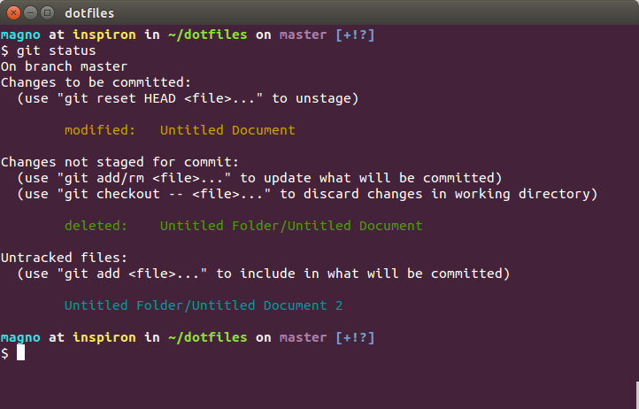
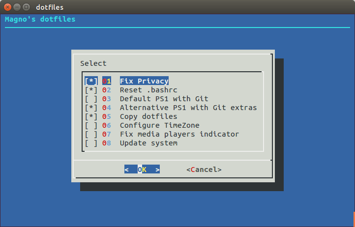

# Magno's dotfiles



## Requirements

```bash
apt-get install -y git xclip # as super user
ssh-keygen -t rsa -b 4096
xclip -sel clip < ~/.ssh/id_rsa.pub
```

Install the public key on your BitBucket <http://bit.ly/1VMnKa3> or GitHub <https://git.io/vw0D8> account.

## Installation

**Warning**: If you want to give these dotfiles a try, you should first fork this repository, review the code, and remove things you don’t want or need. Don’t blindly use my settings unless you know what that entails. Use at your own risk!

### Using Git

```bash
git clone git@github.com:magnobiet/dotfiles.git
cd dotfiles
./install # as super user
```



## License

[MIT](https://magno.mit-license.org/)
